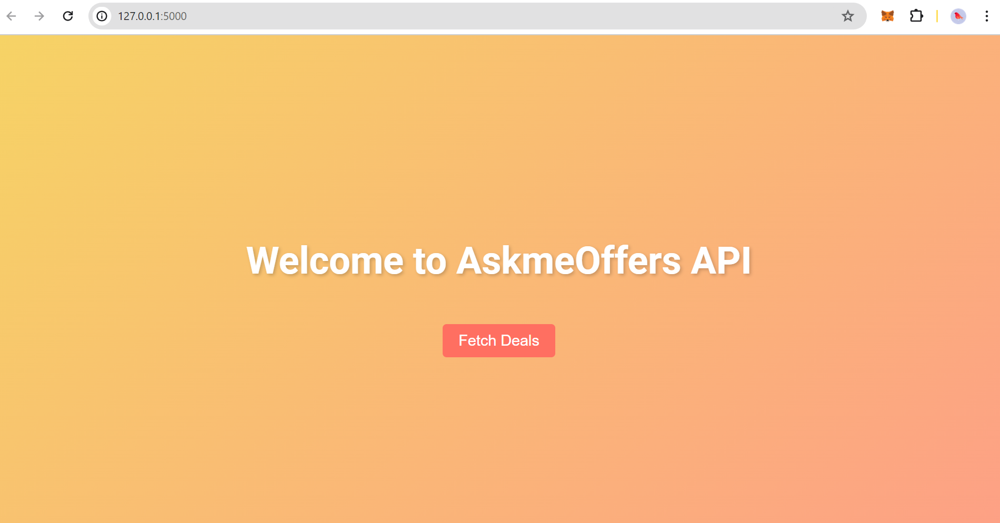
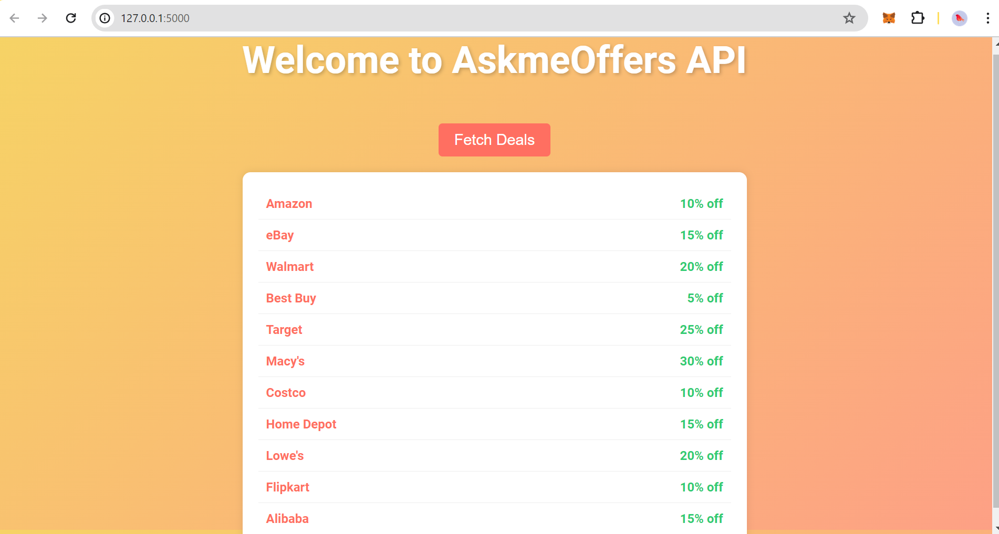
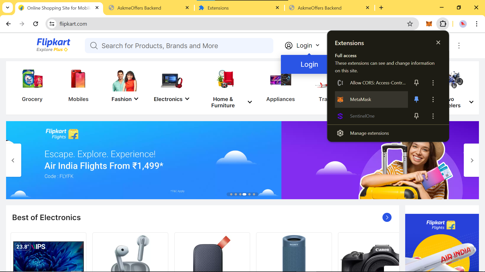
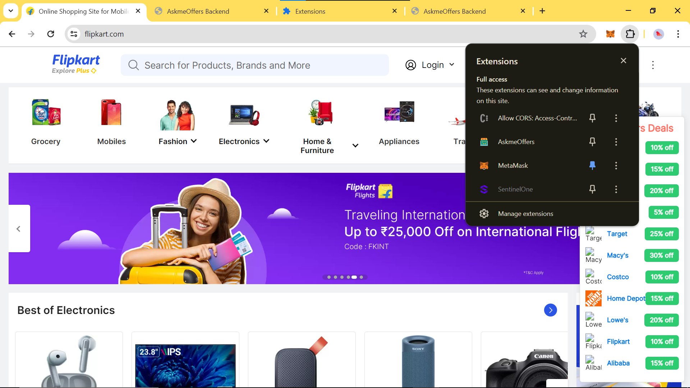
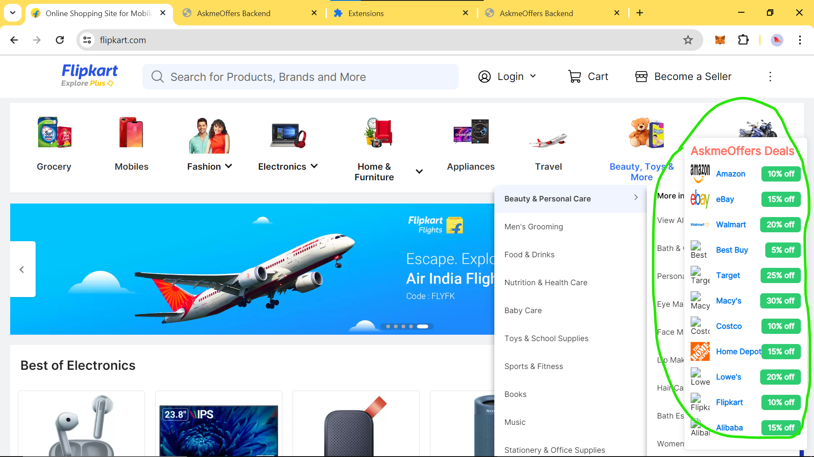

<<<<<<< HEAD
# AskmeOffers Chrome Extension

## Overview

The AskmeOffers Chrome Extension is a Proof of Concept (PoC) project aimed at demonstrating the integration of a Chrome Extension with a Flask AskmeOffers backend to provide users with real-time deals and discounts while browsing online shopping websites.

## Features

- Fetches deals from the AskmeOffers backend API(as I don't have access to it used predfined discounts which can be replaced by connecting to askmeOffers db).
- Displays deals in an attractive format on supported websites.
- Allows users to view details and avail discounts directly from the extension.

## Shows Flow of POC Screenshots for reference 
- Developed a askmeOffers Backend API which contains ecommercite and it's discounts.
- This is the welcome page.

- Fetching details of the ecommerece sites and discounts.

- I'm searching on flipkart to buy a product we can see there is no extension added. 

- Flipkart ecommerce site looks after adding extension to chrome.

- AskmeOffers shows deals, coupons and discounts on the ecommerce site.

# Video Demo

## Technologies Used

- Frontend: HTML, CSS, JavaScript
- Backend: Flask
- Chrome Extension API

## Installation

1. Clone the repository:

- git clone https://github.com/yourusername/askmeoffers-chrome-extension.git

2. Navigate to the backend directory and install the requirements:

- cd askmeoffers-chrome-extension/backend
- pip install -r requirements.txt

3. Run the Flask backend:
- python app.py

4. Load the extension in Chrome:
- Open Chrome and go to chrome://extensions/.
- Enable Developer mode by toggling the switch in the top right corner.
- Click on "Load unpacked" and select the frontend directory from the cloned repository.

### Congrats! The extension has been successfully added. You are good to use it.

## This POC is a chrome extension that displays the latest deals of different top notch ecommerce sites. Welcoming everyone to make your hands dirty for further advancements.
=======
# askmeOffers-chrome-extension
This POC is a chrome extension that displays the latest deals of different top notch ecommerce sites. 
Welcoming everyone to make your hands dirty for further advancements.
>>>>>>> d2fdd74b347b4348510d947687e1fe3dba1af860
